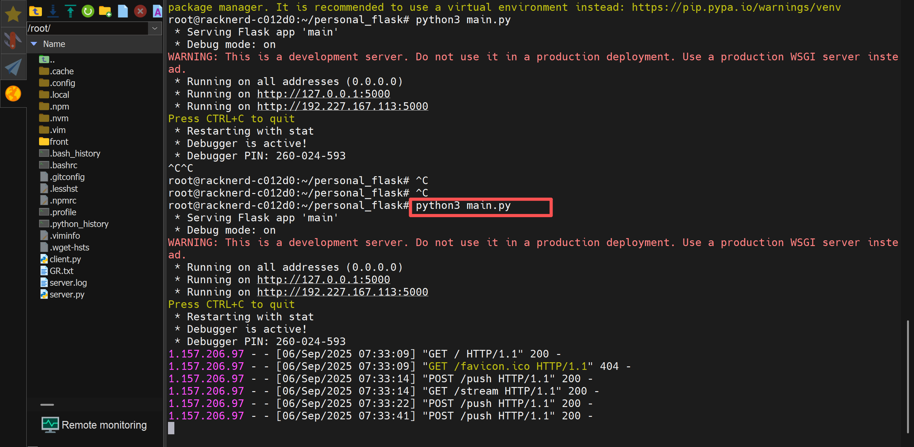

    sudo ufw allow 5000/tcp
    screen -S church-trans
    python3 main.py > log 2>&1

Test command:

    curl -X POST -H "Content-Type: application/json" -d '{"text":"How are you? 你好吗1"}' http://127.0.0.1:5000/push
    curl -X POST -H "Content-Type: application/json" -d '{"text":"How old are you? 你多大2"}' http://127.0.0.1:5000/push
    curl -X POST -H "Content-Type: application/json" -d '{"text":"Why not you? 为什么不是你3"}' http://127.0.0.1:5000/push
    curl -X POST -H "Content-Type: application/json" -d '{"text":"Good looking? 漂亮4"}' http://127.0.0.1:5000/push

